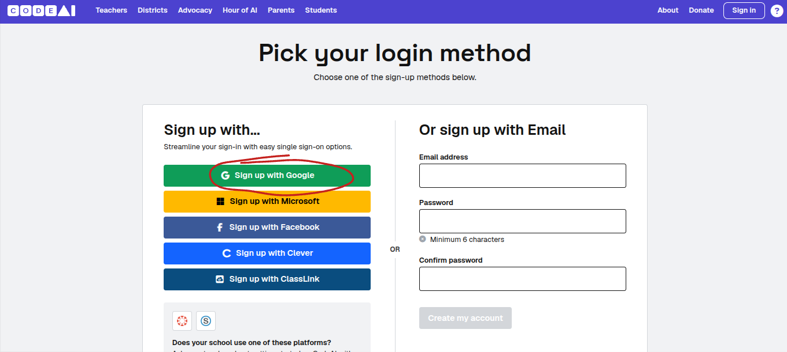
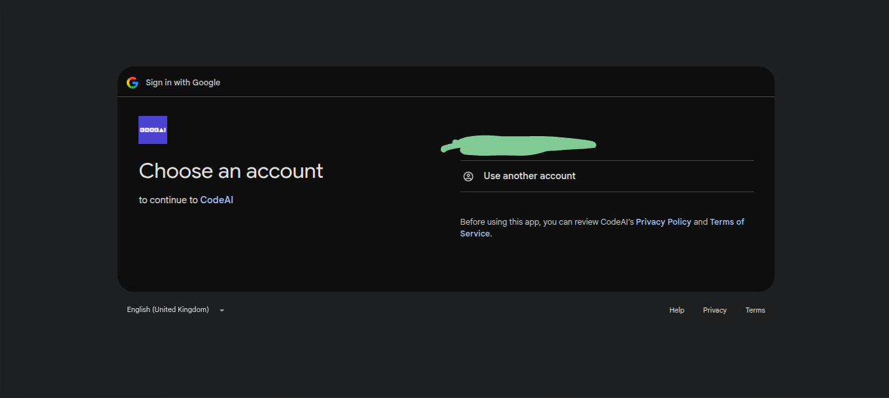

# Sign Up

## How to Sign Up
>[!IMPORTANT]
>You must be at least 13 years old to sign up to CodeAI to comply with US data regulation laws.
  
1. Go to [CodeAI Sign-In Page](https://studio.code.org/users/sign_in)  
2. Click 'Sign in with Google' and select your email.
  
  

## Creating a simple App Lab project
In this tutorial, we will create a simple Tappy Tap game.  
### Creating a new App Lab Project  
1. Click 'Add Project' in the top right corner of your dashboard
2. Select 'App Lab' from the list
  
###Phase 1: Creating the main menu and the start button  
1. Go to the Design tab and rename your screen to mainMenu
2. [Create a new screen](CreateScreen.md) called gameScreen or an id or your choice but keep it descriptive
3. Add a label for a heading and another one for a description of the game. Make sure you use descriptive IDs.  
4. Add a button and call it startGameBtn. Make the text 'Start Game'.  
5. Go back to the Code tab and insert this code:
6. ```
   onEvent("your_start_button_id","click",function() {  
     setScreen("your_game_screen_id");  
   });
   ```
