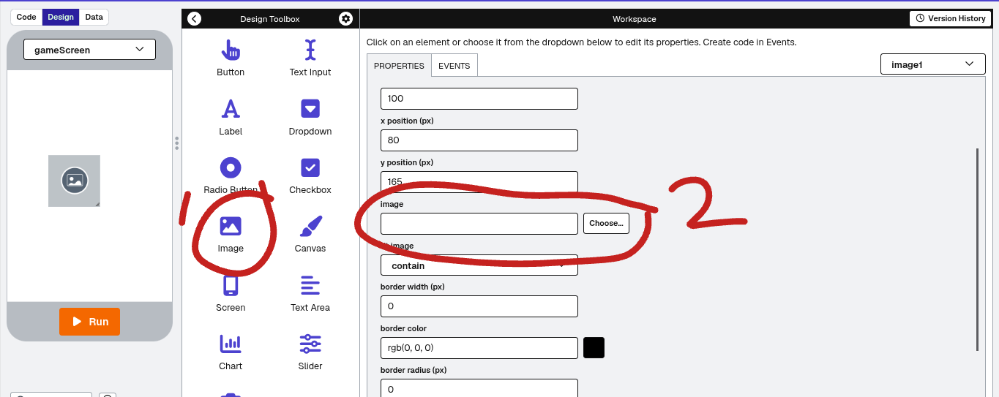

# Creating a simple App Lab project
In this tutorial, we will create a simple Tappy Tap game.  
## Creating a new App Lab Project  
1. Click 'Add Project' in the top right corner of your dashboard
2. Select 'App Lab' from the list  
  

## Creating the menu screen
1. Go to the Design Tab
2. Rename the screen mainMenu or something similar
3. Add a text label and give it a descriptive ID then in the text, put Tappy Tap Tap
4. Add another label, again giving it a descriptive ID and put a brief description in it.
5. Add a button, and call it StartGameBtn (or something similar)
6. Go to the Code tab and select show text in the top right corner
7. Copy this code into the editor:
   ```
   onEvent("YOUR_START_BUTTON_ID","click",function(){
     setScreen("YOUR_GAME_SCREEN_ID");
   });
   ```

## Creating a New Screen
1. Go to the Design Tab
2. Click on the screen name on top of the phone image
3. Click 'Add screen'  
  

## Adding Circles and Score
To add the two circles and a score, follow these steps:
### Creating the Circles
1. Download these two images. They have transparent backgrounds, so they won't show up on a different-coloured background.  
[Blue Cirle](images/blue_dot.png)  
[Red Circle](images/red_dot.png)  
2. Upload them to CodeAI on your game screen:  
  

### Creating the score variable:
1. Go to the editor tab and add this code:
   ```
   var score = "0";
   ```
   to declare a variable  

## [Proceed to Next Step](3-AddLogic.md)
