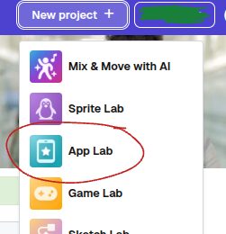
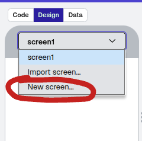

# Creating a simple App Lab project
In this tutorial, we will create a simple Tappy Tap game.  
## Creating a new App Lab Project  
1. Click 'Add Project' in the top right corner of your dashboard
2. Select 'App Lab' from the list  
  

## Creating a New Screen
1. Go to the Design Tab
2. Click on the screen name on top of the phone image
3. Click 'Add screen'  
  

## Adding Circles and Score
To add the two circles and a score, follow these steps:
### Creating the Circles
1. Download these two images. They have transparent backgrounds, so they won't show up on a different-coloured background.  
[Blue Cirle](images/blue_dot.png)  
[Red Circle](images/red_dot.png)
2. Upload them to CodeAI on your game screen:
