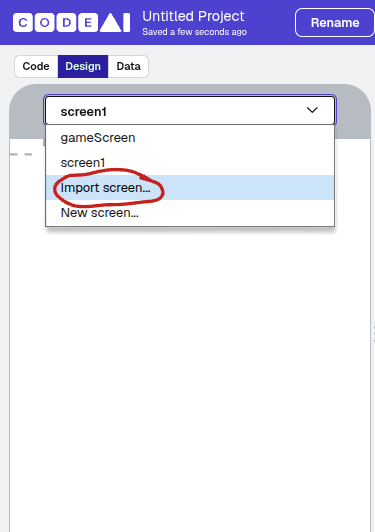

# Adding a time limit
In this section we will explore adding a time limit and changing the screen after the time runs out
## Creating a Score Screen
1. Go to the Design Tab
2. Add a new screen called ScoreScreen (or something similar) with this image upload
  
[ScoreScreen Image](../images/congratulations.png)
Add a text label detailing that this is the score screen.
>[!TIP]  
>Add a button to go back to the homepage
## Adding the limit
1. In the code editor, paste this code in the start button event listener:
   ```
   setTimeout(function() {
     setScreen("YOUR_SCORE_SCREEN_ID");
   }, YOUR_PREFERRED_NUMBER_OF_MILLISECONDS);
>[!NOTE]
>1000 milliseconds equals a second. For example, 5000 milliseconds equals 5 seconds. In the case of your game lasting 5 seconds, please replace 'YOUR_PREFERRED_NUMBER_OF_MILLISECONDS' with 5000.
[Proceed to next step](5-Leaderboard.md)
